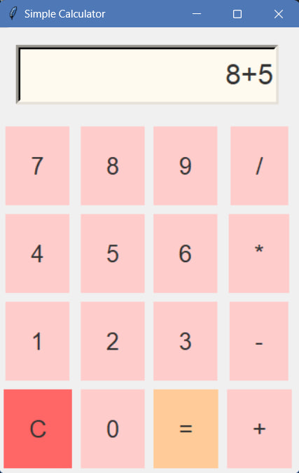

# Simple Calculator in python


A simple, modern, and visually appealing calculator built using Python's Tkinter library. This project features a basic calculator with a clean and minimalist design, perfect for educational purposes or as a starter project for learning GUI development in Python.




## Features

- **Basic Arithmetic Operations**: Supports addition, subtraction, multiplication, and division.
- **Clear Functionality**: Easily clear the current input with the "C" button.
- **Real-time Evaluation**: Instant calculation of expressions using the "=" button.

## Installation

1. **Clone the Repository**:
    ```bash
    git clone https://github.com/HabibaYossre/Simple-Calculator.git
    ```
2. **Navigate to the Project Directory**:
    ```bash
    cd Simple-Calculator
    ```
3. **Run the Calculator**:
    ```bash
    python calculator.py
    ```

